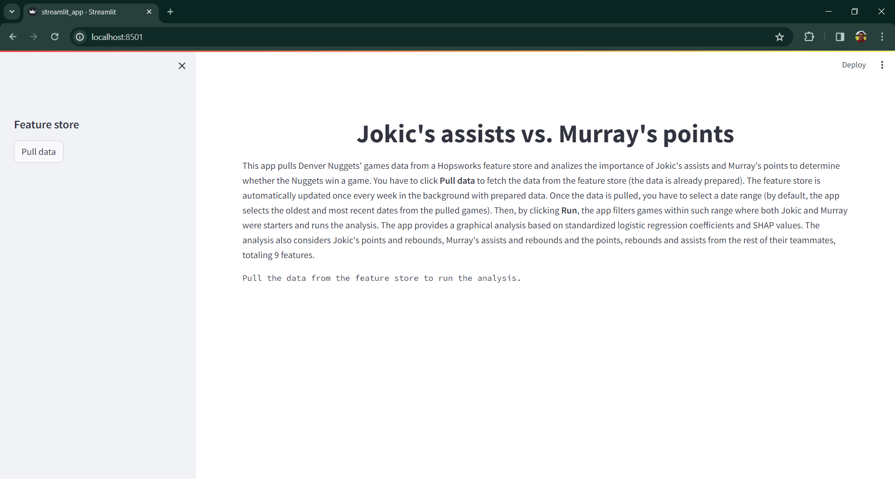
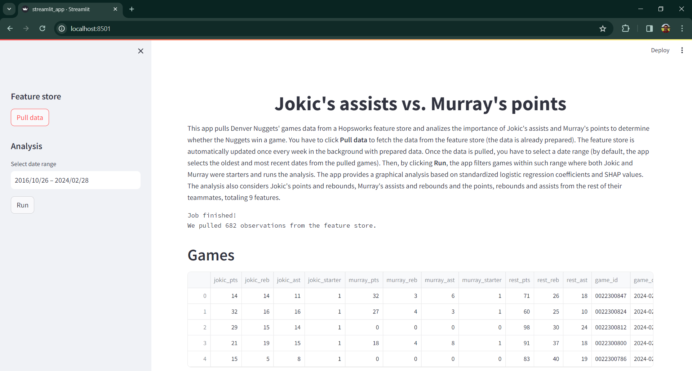
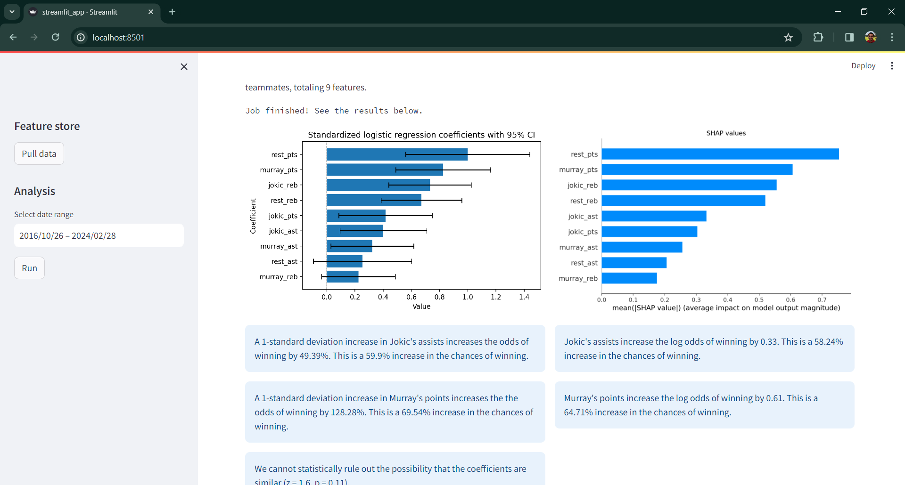

# Jokic's assists and Murray's points: what do the Denver Nuggets miss more?

This app pulls prepared Denver Nuggets' games data from a `Hopsworks` feature store and analizes the importance of Jokic's assists and Murray's points to determine whether the Nuggets win a game. The feature store is automatically updated once every week in the background with prepared data. The app provides a graphical analysis based on standardized logistic regression coefficients and SHAP values. The analysis also considers Jokic's points and rebounds, Murray's assists and rebounds and the points, rebounds and assists from the rest of their teammates, totaling 9 features.

The repo provides the code of a Streamlit app that:

1. Pulls prepared games data of the Denver Nuggets from the feature store.
2. Fits a logistic regression model and computes SHAP values aimed at exploring the importance of Jokic's assists and Murray's points to determine whether the Denver Nuggets win a game.

This update builds on a previous version that allowed the user to fetch data from the [nba_api](https://github.com/swar/nba_api) up to the 2022-23 season, prepare it and push it into the feature store. The update automatizes this flow in the background and pushes new prepared data into the feature store once every week using a cron job.

The app is available at [nba-analysis-jaime.streamlit.app](https://nba-analysis-jaime.streamlit.app/). At the moment of deployment, the feature store has games data up to February 2024's last week (from the 2016-17 season, where Jokic and Murray started playing together for the team).

## Getting started

To reproduce the project locally, make sure to install Python and the project requirements. The project was developed in a Poetry environment (Poetry 1.7.1) in a Ubuntu terminal environment (Ubuntu 22.04.4 LTS) on Windows with Windows Subsystem for Linux (WSL). Make sure to create a Poetry environment using the requirements listed in the file `requirements.txt`. This requires to:

First, initialize Poetry within the project's root folder:

```bash
poetry init
```

And, then, install the requirements:[^1]

```bash
poetry add `cat requirements.txt`
```

[^1]: I had an issue during the requirements installation that wasn't related to the dependency resolver. The installation of one particular dependency, `twofish`, was raising an error related to a file named `Python.h` that wasn't found. [Borislav Hadzhiev's website](https://bobbyhadz.com/blog/python-fatal-error-python-h-no-such-file-or-directory) provides a solution.

## Scripts

The app works with six Python scripts stored in the folder **src**.

### streamlit_app.py

This script contains the frontend code based on Streamlit. The landing interface looks like shown in Figure 1:

<p style="line-height:0.5" align="center">
    
</p>
<p style="line-height:0.5" align="center"><b>Figure 1.</b> Streamlit app landing interface.</p>

The user must click **Pull data** to fetch all available games data from the `Hopsworks` feature store. Once the data is pulled, the interface looks like shown in Figure 2:

<p style="line-height:0.5" align="center">
    
</p>
<p style="line-height:0.5" align="center"><b>Figure 2.</b> Streamlit app interface with pulled data.</p>

The user must select a date range for the analysis. By default, the app selects the oldest and most recent dates from the pulled games, i.e., it would use all pulled data for the analysis. Then, by clicking **Run**, the app filters games within such range where both Jokic and Murray were starters and runs the analysis. This analysis requires at least 180 observations (i.e., games where both Jokic and Murray were starters). If this threshold isn't met, the app lets the user know about it and asks her to revise the date range and try again.

The interface with the final results looks like shown in Figure 3:

<p style="line-height:0.5" align="center">
    
</p>
<p style="line-height:0.5" align="center"><b>Figure 3.</b> Streamlit app interface with analysis.</p>

### data.py

This script contains the code that pulls the games data from the `Hopsworks` feature store.

In the previuos version, the app connected to the feature store to check whether all requested data was stored there (based on a pair of season sliders). If it wasn't, the app connected to the `nba_api` to pull the lacking games data, prepared it and updated the feature store. Currently, the feature store is updated automatically once every week with prepared data using a cron job.

This script contains the functions to pull all available data from the feature store and filter it by date range and according to whether both Jokic and Murray were starters. Most of the previous functionality of this script was adapted and moved to the script that automatically updates the feature store: `fetch_data_cron.py`.

### fetch_data_cron.py

This script contains the code that automatically updates the feature store with new prepared games data. The code connects to the `Hopsworks` feature store, finds the most recent game available and pulls its date. Then, it connects to the `nba_api` to fetch games data from such date onward, prepares the data and pushes it into the feature store.[^2]

[^2]: There's an additional related script named `fetch_data_github_action.py` that performs the same processes. However, it seems the NBA blocks connections triggered from GitHub Actions, for which reason the script isn't used by the app. I make it available together with the GitHub Action workflow file in the folder **.github** for the sake of learning.

The script is run once every week using a cron job. The cron job uses a bash script named `fetch_data_cron.sh` stored in the folder **src**. The script navigates to the folder **src** using a function, activates the Poetry environment and runs the script. Please update the paths and the name of the Poetry environment accordingly.

The cron job is scheduled to run at 12:00 every Thursday and creates a log in the folder **logs**. The file `cron_job.txt` in the folder **src** contains the cron job configuration. Please update the paths accordingly and then copy and paste the content in `crontab`.

To make sure the job runs automatically, I configured my computer to start the cron service at startup. To achieve this, I first needed to prevent WSL to ask for a password to start the cron service. This requires to modify the file `etc/sudoers`. Start your WSL terminal and open the sudoers file with the following command:

```bash
sudo visudo
```

Add the following line:

```vim
%sudo ALL=NOPASSWD: /usr/sbin/service cron start
```

Then, in Windows, I created a `.bat` file with the following content:

```bat
wsl sudo service cron start
```

Finally, I moved this file to the Windows startup directory. You can open this directory by executing `shell:startup` in Windows Run (open Windows Run by pressing the Windows key + R).[^3]

[^3]: Please note that the steps needed to configure the cron job might change depending on your system (recall that I work in a Ubuntu terminal environment (Ubuntu 22.04.4 LTS) on Windows with WSL).

### feature_store.py

This script contains supporting functions used by `data.py` and `fetch_data_cron.py` to connect to the `Hopsworks` feature store and retrieve games data stored in it.

### config.py

This script contains code that loads supporting credential data used by `feature_store.py` to connect to the `Hopsworks` feature store. While the script provides three different ways to load such data, the app only uses the one that relies on Streamlit Secrets Management (SSM). However, I leave all three for the sake of completeness and learning.

When using SSM, you need to create (i) a folder named `.streamlit` in the folder **src** and (ii) a file inside `.streamlit` named `secrets.toml` with the following data:[^4]

```toml
HOSTNAME = "HOSTNAME"
HOPSWORKS_PROJECT_NAME = "HOPSWORKS_PROJECT_NAME"
HOPSWORKS_API_KEY = "HOPSWORKS_API_KEY"
FEATURE_GROUP_NAME = "FEATURE_GROUP_NAME"
FEATURE_VIEW_NAME = "FEATURE_VIEW_NAME"
```

[^4]: When implementing your own app, please make sure to replace the placeholders accordingly. This also applies for the other two ways of loading the supporting credential data. Please also note that only the first parameter (`HOSTNAME`) is provided by Hopsworks; the remaining four are configured by the user.

This file is used during local development. When deploying the app, you need to define these variables as environment variables in your app's **Advanced settings...** Please check [SSM's documentation](https://docs.streamlit.io/streamlit-community-cloud/deploy-your-app/secrets-management) for an overview.

If you want to load the data using environment variables, you need to create the file `.env` in the folder **src** with the following data:

```sh
HOSTNAME=HOSTNAME
HOPSWORKS_PROJECT_NAME=HOPSWORKS_PROJECT_NAME
HOPSWORKS_API_KEY=HOPSWORKS_API_KEY
FEATURE_GROUP_NAME=FEATURE_GROUP_NAME
FEATURE_VIEW_NAME=FEATURE_VIEW_NAME
```

If you want to load the data using a JSON file, you need to create the file `metadata.json` in the folder **src** with the following data:

```json
{
"HOSTNAME": "HOSTNAME",
"HOPSWORKS_PROJECT_NAME": "HOPSWORKS_PROJECT_NAME",
"HOPSWORKS_API_KEY": "HOPSWORKS_API_KEY",
"FEATURE_GROUP_NAME": "FEATURE_GROUP_NAME",
"FEATURE_VIEW_NAME": "FEATURE_VIEW_NAME"
}
```

Regardless of the way of loading the supporting credential data, please bear in mind it's considered bad practice to store unencrypted credential data in a git repository. SSM allows to bypass this issue.

### modeling.py

This script contains the code that fits the logistic regression model to the games data and computes the SHAP values.

## Credits

This project was motivated by a question raised by the great Ernesto Jerez during the transmission of the 2022-2023 NBA finals between the Denver Nuggets and the Miami Heat and my interest in data science.

The idea of deploying the app and using a feature store was motivated by reading [Pau Labarta Bajo's blog](https://datamachines.xyz/). The script `feature_store.py` builds on his implementation in [Build and deploy a real-time feature pipeline with Python](https://github.com/Paulescu/build-and-deploy-real-time-feature-pipeline/).

I highly appreciate feedback and you can reach out to me on [LinkedIn](https://bit.ly/jaime-linkedin) any time. I'm also working on other projects. Check this out in my [personal website](https://bit.ly/jaime-website).

Thanks for reading!
