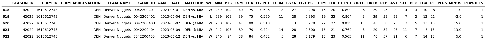
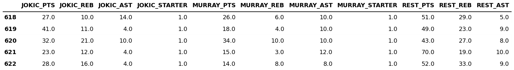
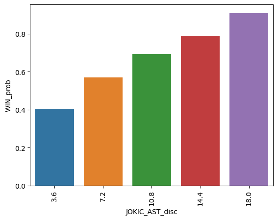
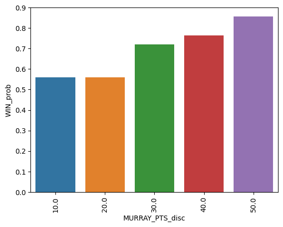
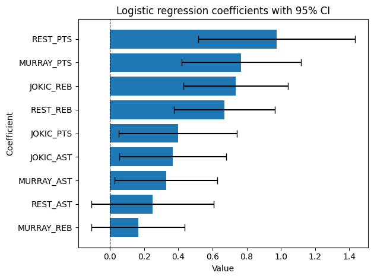
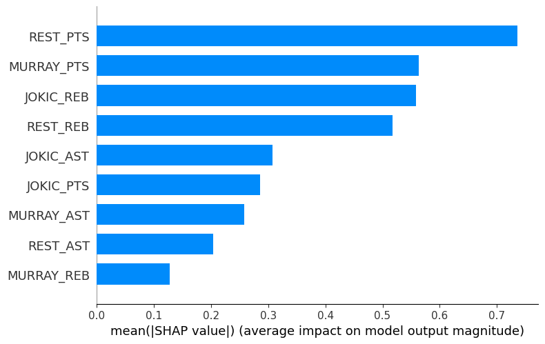

# Jokic's assists vs. Murray's points

In this repo I provide Python notebooks to (i) extract games data for a given NBA team using the `nba_api` endpoints `leaguegamefinder` and `boxscoretraditionalv2`, (ii) perform a basic EDA and (iii) and fit a logistic regression model aimed at exploring the importance of Jokic's assists and Murray's points to determine whether the Denver Nuggets win a game.

The motivation for this work came to me while watching last season's (2022-2023) NBA finals between the Nuggets and the Miami Heat. I was watching the finals on ESPN when one of the commentators, the great Ernesto Jerez, asked what were the Nuggets missing more: Jokic's assists or Murray points. I don't recall what game was it nor the exact moment during the game when Ernesto raised this question, and it seems difficult to pinpoint it since the Nuggets were rarely trailing behind in the score during any of the finals games.

At any rate, I found the question interesting and decided to do some data science work to find an answer. The work starts by pulling some relevant data, continues with a basic EDA and finishes with a modeling work, each of these performed in its own notebook.

The analysis is based on all games from 2016-2017 to 2022-2023 without separating regular season and playoff games. A minor update could discriminate the analysis based on regular season and playoff games. Another future (and major) update could extend this work to analyze sets of players from different teams and update the results as data from new games become available.  

## Getting started

Please make sure to install Python and the project requirements. The requirements are listed in the file `requirements.txt` and can be installed in a Linux terminal with the following command:[^1]

[^1]: Note the `python -m` at the beggining of the command. While running `pip` this way inside a virtual environment is not necessary, it's good practice to run it this way. See [Why you should use `python -m pip`](https://snarky.ca/why-you-should-use-python-m-pip/) for an explanation about running `pip` with and without `python -m`.

```bash
python -m pip install -r requirements.txt
```

You can do the same with the file `dev-requirements.txt`. This file lists some linting and code formatting libraries that can be used with a source-code editor like VS Code.

## Notebooks

The three notebooks and supporting files are in the folder **jokic_murray**.

### etl

This notebook documents the work done to get familiarized with the API and pull the data to answer the research question.

An important assumption of the work is that you must know the seasons during which the players of interest played together for a team. In this particular case, thanks to a Google search, I learned Jokic and Murray have been Nuggets teammates since the 2016-2017 season. Thus, I focused on pulling Nuggets' games data from the 2016-2017 to the 2022-2023 seasons. This was done using the endpoint `leaguegamefinder`. My initial approach, although worked, was far from polished. For example, I pulled games season by season, deleting summer league games season by season. Figure 1 below shows the tail of the DataFrame. Since the data is sorted in ascending order by the column $GAME\_DATE$, the figure shows the Nuggets' data from the 2022-2023 NBA finals.

<p style="line-height:0.5" align="center">
    
</p>
<p style="line-height:0.5" align="center"><b>Figure 1.</b> Nuggets' games data: 2016-17 to 2022-23.</p>

Once the games data was pulled, the next step was to pull the main stats of both players (points, rebounds and assists and whether they were starters) for each of the games, compute those stats for the rest of the teammates combined and append these features to the games data. This was done using the endpoint `boxscoretraditionalv2` and additional data preparation work. These features look as shown by Figure 2 below.

<p style="line-height:0.5" align="center">
    
</p>
<p style="line-height:0.5" align="center"><b>Figure 2.</b> Nuggets' games data revised: 2016-17 to 2022-23.</p>

Finally, I saved the data from games where both Jokic and Murray were starters.

At the end of the notebook, I provide functions that generalize the work. While they provide a great improvement, I believe they could be further improved, especially the functions that take care of pulling the players stats and appending them to the games data.

From the different CSV files that are generated throughout the notebook, I only provide the one generated at the end of Section 2.3 (**nuggets_2016_17_2022_23_j_m.csv**), which is the one used in the EDA. Please follow the notebook to check the work and generate the rest of the files.

### eda

This is largerly a notebook with a graphical analysis with no insights derived from it (my bad, apologies). Here, I take two plots from the EDA to get a sense of how the probability of the Nuggets winning a game increases with Jokic's assists and Murray's points. Figure 3 below shows the plots. Each plot discretizes the feature of interest in five bins and plots the probability of winning in each bin. While the probability of winning increases with both Jokic's assists and Murray's points, it's difficult to pinpoint which one has a stronger effect based solely on these two plots.  

<table>
    <tr>
        <td>
            
        </td>
        <td>
            
        </td>
   </tr>
</table>
<p style="line-height:0.5" align="center"><b>Figure 3.</b> Jokic's assits (left) and Murray's points (right) influence on winning probability.</p>

At the end of the notebook, I save the following data for later use in the modeling work: points, rebounds and assists from Jokic, Murray and the rest of their teammates combined for each game where both Jokic and Murray were starters, plus two dummies that capture whether the game was a win and whether it was a playoff game. The data is saved in the CSV file **model_data.csv**.

### modeling

This notebook fits a logistic regression model using data from all games. The analysis focuses on fitting the model with unstandardized and standardized coefficients and computing the SHAP values of the standardized model. Figure 4 below plots the results from the standardized logistic regression and the SHAP analysis. While both the standardized model and the SHAP values suggest Murray's points are more important than Jokic's assists to determine whether the Nuggets win a game, the evidence isn't bulletproof: the difference between the standardized coefficients is marginal at best and, to the best of my knowledge, we cannot statistically compare the SHAP values to make a stronger point.

<table>
    <tr>
        <td>
            
        </td>
        <td>
            
        </td>
   </tr>
</table>
<p style="line-height:0.5" align="center"><b>Figure 4.</b> Regression coefficients (left) and SHAP values (right).</p>

Finally, I did use the results of the EDA: a correlation matrix suggests the points from Jokic and Murray teammates might be redundant, so I fit another model without this feature and compared both models using the Akaike Information Criterion (AIC). Comparing the AICs indicates the original model is preferred.

## Credits

This project was motivated by a question raised by the great Ernesto Jerez during the transmission of the 2022-2023 NBA finals between the Denver Nuggets and the Miami Heat and my interest in data science.

I highly appreciate feedback and you can reach out to me on [LinkedIn](https://bit.ly/jaime-linkedin) any time. I'm also working on other projects. Check this out in my [personal website](https://bit.ly/jaime-website).

Thanks for reading!
