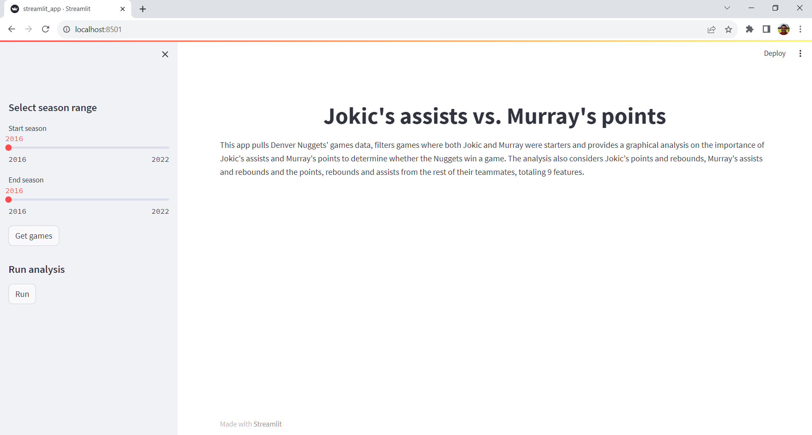
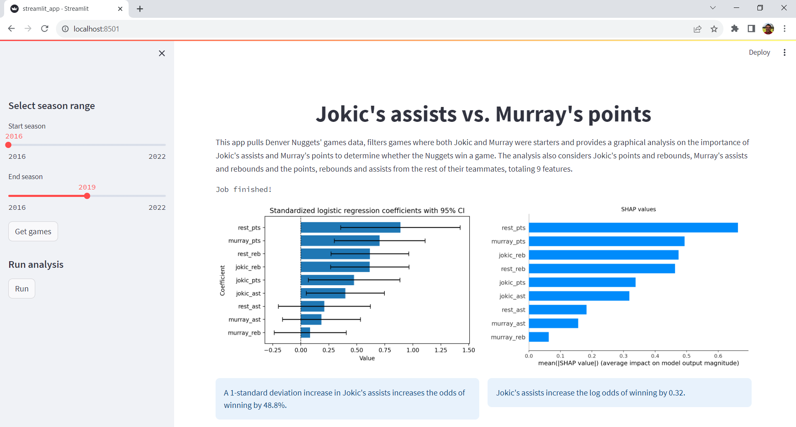

# Jokic's assists and Murray's points: what do the Denver Nuggets miss more?

This repo provides the code of a Streamlit app that:

1. Pulls games data of the Denver Nuggets from a `Hopsworks` feature store or the [nba_api](https://github.com/swar/nba_api).
2. Fits a logistic regression model and computes SHAP values aimed at exploring the importance of Jokic's assists and Murray's points to determine whether the Denver Nuggets win a game.

This update builds on a previous version that relied on notebooks to perform this work. The README of the previuos version can be found in the folder **jokic_murray**. Please refer to that README for details about that work.

The app is available at [nba-analysis-jaime.streamlit.app](https://nba-analysis-jaime.streamlit.app/). At the moment of deployment, the feature store has games data up to the 2019-20 season (from the 2016-17 season, where Jokic and Murray started playing together for the team). This amount of data allows to run the analysis. Please bear in mind this amount of data could change if an user pushes more data into the feature store or if I work in the app to update it.

## Getting started

Please make sure to install Python and the project requirements. The requirements are listed in the file `requirements.txt` and can be installed in a Linux terminal with the following command:[^1]

[^1]: Note the `python -m` at the beggining of the command. While running `pip` this way inside a virtual environment is not necessary, it's good practice to run it this way. See [Why you should use `python -m pip`](https://snarky.ca/why-you-should-use-python-m-pip/) for an explanation about running `pip` with and without `python -m`.

```bash
python -m pip install -r requirements.txt
```

You can do the same with the file `dev-requirements.txt`. This file lists some linting and code formatting libraries that can be used with a source-code editor like VS Code.

## Scripts

The app works with five Python scripts stored in the folder **src**.

### streamlit_app.py

This script contains the frontend code based on Streamlit. The landing interface looks like shown in Figure 1:

<p style="line-height:0.5" align="center">
    
</p>
<p style="line-height:0.5" align="center"><b>Figure 1.</b> Streamlit app landing interface.</p>

The user must select the range of seasons for the analysis using the sliders. Once the user hits **Get games**, the app checks whether the data is stored in the `Hopsworks` feature store that feeds the app. If all or some data isn't in the feature store, the app connects to the `nba_api` to pull this data, prepares it and updates the feature store.

Once this work is done, the user can hit **Run analysis** so that the app runs the logistic regression and computes the SHAP values. This analysis requires at least 180 observations (i.e., games where both Jokic and Murray were starters). If this threshold isn't met, the app lets the user know about it and asks her to pull more data.

The interface with the final results looks like shown in Figure 2:

<p style="line-height:0.5" align="center">
    
</p>
<p style="line-height:0.5" align="center"><b>Figure 2.</b> Streamlit app interface with analysis.</p>

### data.py

This script contains the code that pulls and prepares games data from the `nba_api` and pushes this data into the `Hopsworks` feature store.

In a previous version of the app, when the user hit **Get games**, the app first connected to the `nba_api` to pull the basic games data from the selected seasons and then connected to the `Hopsworks` feature store to check whether all requested data was stored there (this was done by checking the game ids pulled from the `nba_api` against the game ids pulled from the feature store and was motivated by my understanding at the time of how `Hopsworks` worked).[^2]

Currently, when the user hits **Get games**, the app connects to the `Hopsworks` feature store to check whether all requested data is stored there. If it isn't, the app connects to the `nba_api` to pull the lacking games data, prepares it and updates the feature store. Otherwise, the app lets the user know that all requested data is in the feature store.

[^2]: I thought I needed game ids (or whatever feature(s) I defined as primary key when creating a feature group) to retrieve data from the feature store. Thus, I used to pull game ids from the `nba_api` and then used them to retrieve data from the feature store. While this works, the class `FeatureGroup` offers a simpler way to extract all data from the feature store through its function `read`.

When all this process finishes, a message shown in the interface lets the user know how many observations were pulled from (i) the `Hopsworks` feature store and (ii) the `nba_api`.

### feature_store.py

This script contains supporting functions used by `data.py` to connect to the `Hopsworks` feature store and retrieve games data stored in it.

### config.py

This script contains code that loads supporting credential data used by `feature_store.py` to connect to the `Hopsworks` feature store. While the script provides three different ways to load such data, the app only uses the one that relies on Streamlit Secrets Management (SSM). However, I leave all three for the sake of completeness and learning.

When using SSM, you need to create (i) a folder named `.streamlit` in the folder **src** and (ii) a file inside `.streamlit` named `secrets.toml` with the following data:[^3]

```toml
HOPSWORKS_PROJECT_NAME = "HOPSWORKS_PROJECT_NAME"
HOPSWORKS_API_KEY = "HOPSWORKS_API_KEY"
FEATURE_GROUP_NAME = "FEATURE_GROUP_NAME"
FEATURE_VIEW_NAME = "FEATURE_VIEW_NAME"
```

[^3]: When implementing your own app, please make sure to replace the placeholders accordingly. This also applies for the other two ways of loading the supporting credential data.

This file is used during local development. When deploying the app, you need to define these variables as environment variables in your app's **Advanced settings...** Please check [SSM's documentation](https://docs.streamlit.io/streamlit-community-cloud/deploy-your-app/secrets-management) for an overview.

If you want to load the data using environment variables, you need to create the file `.env` in the folder **src** with the following data:

```sh
HOPSWORKS_PROJECT_NAME=HOPSWORKS_PROJECT_NAME
HOPSWORKS_API_KEY=HOPSWORKS_API_KEY
FEATURE_GROUP_NAME=FEATURE_GROUP_NAME
FEATURE_VIEW_NAME=FEATURE_VIEW_NAME
```

If you want to load the data using a json file, you need to create the file `metadata.json` in the folder **src** with the following data:

```json
{
"HOPSWORKS_PROJECT_NAME": "HOPSWORKS_PROJECT_NAME",
"HOPSWORKS_API_KEY": "HOPSWORKS_API_KEY",
"FEATURE_GROUP_NAME": "FEATURE_GROUP_NAME",
"FEATURE_VIEW_NAME": "FEATURE_VIEW_NAME"
}
```

Regardless of the way of loading the supporting credential data, please bear in mind it's considered bad practice to store unencrypted credential data in a git repository. SSM allows to bypass this issue.

### modeling.py

This script contains the code that fits the logistic regression model to the games data and computes the SHAP values.

## Credits

This project was motivated by a question raised by the great Ernesto Jerez during the transmission of the 2022-2023 NBA finals between the Denver Nuggets and the Miami Heat and my interest in data science.

The idea of deploying the app and using a feature store was motivated by reading [Pau Labarta Bajo's blog](https://datamachines.xyz/). The script `feature_store.py` builds on his implementation in [Build and deploy a real-time feature pipeline with Python](https://github.com/Paulescu/build-and-deploy-real-time-feature-pipeline/).

I highly appreciate feedback and you can reach out to me on [LinkedIn](https://bit.ly/jaime-linkedin) any time. I'm also working on other projects. Check this out in my [personal website](https://bit.ly/jaime-website).

Thanks for reading!
